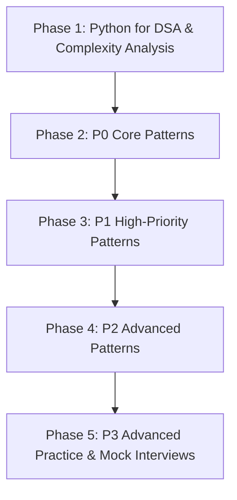

# DSA & Problem-Solving Learning Roadmap

A structured, 5-phase preparation roadmap engineered for product-based company coding interviews. This plan prioritizes deep pattern comprehension, deliberate practice, edge-case mastery, and independent problem-solving over memorizing hundreds of questions.

---

## The Core Philosophy
1. **Understand Patterns, Not Solutions:** Never jump directly to editorial solutions. Spend 20–30 minutes developing your own mental model, dry-running test inputs on paper.
2. **Code Cleanly in Python 3:** Master Pythonic idioms, standard library capabilities (`collections`, `heapq`, `bisect`), and space-time efficiency.
3. **Document Mistakes Immediately:** Every failure is an asset if logged. Off-by-one errors, state invalidation, and subtle condition checks belong in your problem log.
4. **Enforce Spaced Repetition:** Re-solving a problem after 3 days without looking at notes builds lasting problem-solving neural pathways.

---

## Roadmap Phases

---

### Phase 1: Python for DSA & Complexity Analysis

*Master the programming language mechanics, algorithmic cost models, and recursion foundations before tackling complex patterns.*

#### 1. Learning Objectives
- Gain fluent command of Python built-in data structures (`list`, `dict`, `set`, `deque`, `tuple`).
- Understand exact asymptotic time and space costs for Python operations (e.g., list slicing $O(K)$, dict hashing $O(1)$ amortized, set lookups).
- Master Big-$O$, Big-$\Omega$, and Big-$\Theta$ notations, recursion tree analysis, and the Master Theorem basics.
- Understand recursion stack depth, base cases, call frame anatomy, and recursion limit hazards in Python.

#### 2. Curriculum & Sequence
1. [Python Built-ins for DSA](00-Python-Fundamentals/python-builtins-for-dsa.md)
2. [Complexity Analysis & Asymptotics](00-Python-Fundamentals/complexity-analysis.md)
3. [Recursion Basics & Call Stacks](00-Python-Fundamentals/recursion-basics.md)

#### 3. Recommended Practice Workflow
- Benchmark slicing vs index iteration.
- Implement iterative and recursive forms of basic operations (factorial, Fibonacci, array reversal).
- Trace recursion stack frames manually with variable diagrams.

#### 4. Criteria for Moving to Phase 2
- [ ] Able to accurately analyze both time and space complexity of any iterative or recursive Python function.
- [ ] Confident selecting between `collections.defaultdict`, `collections.Counter`, and regular `dict`.
- [ ] Can explain when list operations cost $O(1)$ vs $O(N)$ (e.g., `append()` vs `insert(0, val)` or `pop()` vs `pop(0)`).

---

### Phase 2: P0 Core Patterns (Interview Fundamentals)

*The absolute bedrock of coding interviews. 70%+ of typical interview rounds test or compose these core patterns.*

#### 1. Learning Objectives
- Eliminate nested loops ($O(N^2)$ to $O(N)$) using pointer convergence, window expansion/shrinking, and frequency maps.
- Master modified binary search boundaries and invariant conditions (`left <= right` vs `left < right`).
- Understand LIFO/FIFO patterns for matching parentheses, monotonic evaluation, and buffer simulation.
- Traverse 2D grids with boundary safety and coordinate offsets.

#### 2. Pattern Sequence
1. [01 - Arrays & Strings](P0-Core/01-Arrays-and-Strings/README.md)
2. [02 - Hashing](P0-Core/02-Hashing/README.md)
3. [03 - Two Pointers](P0-Core/03-Two-Pointers/README.md) *(Opposite, Same-direction, Read-write, 3Sum, Triplet counting)*
4. [04 - Sliding Window](P0-Core/04-Sliding-Window/README.md) *(Fixed vs Dynamic window)*
5. [05 - Binary Search](P0-Core/05-Binary-Search/README.md) *(Exact match, boundary search, search on answer)*
6. [06 - Sorting](P0-Core/06-Sorting/README.md) *(Custom sort, Dutch National Flag, QuickSelect)*
7. [07 - Stack & Queue](P0-Core/07-Stack-and-Queue/README.md) *(Parentheses matching, deque simulations)*
8. [08 - Two-Dimensional Arrays](P0-Core/08-Two-Dimensional-Arrays/README.md) *(Matrix traversals, spiral order, rotation)*
9. [09 - Basic Recursion](P0-Core/09-Basic-Recursion/README.md) *(Divide & conquer foundations, subsets)*

#### 3. Recommended Practice Workflow
- For each pattern:
  1. Read the pattern README and understand the general reusable template.
  2. Solve 4–6 representative problems starting from Easy to Medium.
  3. Log each problem in its respective `problems/` folder.
  4. Write a concise interview explanation for each problem.

#### 4. Criteria for Moving to Phase 3
- [ ] Solved 25+ problems across P0 patterns independently.
- [ ] Consistently identify whether a problem calls for Two Pointers, Sliding Window, or Hashing within 3 minutes of reading the prompt.
- [ ] Never get stuck in an infinite binary search loop.

---

### Phase 3: P1 High-Priority Patterns

*Standard medium-to-hard patterns tested heavily by top tech companies, tier-1 product startups, and FAANG/MAANG companies.*

#### 1. Learning Objectives
- Manipulate pointers in linked structures without losing node references.
- Traverse trees recursively and iteratively (pre-order, in-order, post-order, level-order).
- Manage top-K elements and continuous streaming metrics using min-heaps and max-heaps.
- Solve interval overlapping, merging, and scheduling problems.
- Master state-space exploration via backtracking and pruning.
- Efficiently compute contiguous subarray sums using Prefix Sums and HashMaps.

#### 2. Pattern Sequence
1. [01 - Linked List](P1-High-Priority/01-Linked-List/README.md) *(Fast & slow pointers, in-place reversal)*
2. [02 - Trees & Binary Trees](P1-High-Priority/02-Trees-and-Binary-Trees/README.md) *(DFS, BFS, diameter, lowest common ancestor)*
3. [03 - Binary Search Tree](P1-High-Priority/03-Binary-Search-Tree/README.md) *(BST invariants, validation, recovery)*
4. [04 - Heap & Priority Queue](P1-High-Priority/04-Heap-and-Priority-Queue/README.md) *(Top-K, median finder, k-way merge)*
5. [05 - Prefix Sum](P1-High-Priority/05-Prefix-Sum/README.md) *(Subarray sum equals K, 2D prefix sums)*
6. [06 - Intervals](P1-High-Priority/06-Intervals/README.md) *(Merge intervals, insert interval, meeting rooms)*
7. [07 - Greedy](P1-High-Priority/07-Greedy/README.md) *(Locally optimal choice, jump game, gas station)*
8. [08 - Backtracking](P1-High-Priority/08-Backtracking/README.md) *(Permutations, combinations, N-Queens, Sudoku)*
9. [09 - Monotonic Stack](P1-High-Priority/09-Monotonic-Stack/README.md) *(Next greater element, largest rectangle in histogram)*

#### 3. Recommended Practice Workflow
- Practice drawing tree and linked-list pointer diagrams before writing code.
- Implement recursion with strict state restoration for backtracking.
- Use `PROGRESS.md` to keep track of completion across all 9 patterns.

#### 4. Criteria for Moving to Phase 4
- [ ] Confident with pointer manipulations in linked lists (reversal, cycle detection).
- [ ] Seamlessly write BFS (queue) and DFS (stack/recursion) tree traversals.
- [ ] Backtracking problems written with clean choose-explore-unchoose patterns.

---

### Phase 4: P2 Advanced Patterns

*Advanced graph theory, dynamic programming, and specialized tree structures for senior, staff, and top-tier product company roles.*

#### 1. Learning Objectives
- Represent and traverse general graphs (directed, undirected, weighted, cyclic).
- Detect cycles, find connected components, and compute shortest paths.
- Understand dependency resolution via Topological Sort (Kahn's algorithm & DFS).
- Master dynamic programming state definition, recurrence relation derivation, base cases, and space optimization (1D vs 2D arrays).
- Utilize Disjoint Set Union (Union-Find) with path compression and union by rank.
- Implement Tries for prefix matching and autocomplete engines.

#### 2. Pattern Sequence
1. [01 - Graphs](P2-Advanced/01-Graphs/README.md)
2. [02 - Graph Traversal BFS/DFS](P2-Advanced/02-Graph-Traversal-BFS-DFS/README.md)
3. [03 - Topological Sort](P2-Advanced/03-Topological-Sort/README.md)
4. [04 - Union-Find](P2-Advanced/04-Union-Find/README.md)
5. [05 - Tries](P2-Advanced/05-Tries/README.md)
6. [06 - Dynamic Programming](P2-Advanced/06-Dynamic-Programming/README.md) *(1D, 2D, Knapsack, LCS, LIS)*
7. [07 - Bit Manipulation](P2-Advanced/07-Bit-Manipulation/README.md) *(Bitmasks, XOR tricks, power of two)*
8. [08 - Advanced Trees](P2-Advanced/08-Advanced-Trees/README.md) *(Segment Tree / Fenwick Tree concepts)*

#### 3. Recommended Practice Workflow
- Derive DP equations on paper first: `dp[i] = ...` before touching the keyboard.
- Convert memoized top-down solutions to bottom-up tabular solutions.
- Optimize space complexity from $O(N \times M)$ to $O(M)$ when current state only depends on the previous row.

#### 4. Criteria for Moving to Phase 5
- [ ] Can break down 1D and 2D DP problems systematically (state, base case, transition).
- [ ] Implement Union-Find and Topological Sort from memory in under 5 minutes.
- [ ] Accurately differentiate between BFS (shortest path in unweighted graph) and Dijkstra's algorithm.

---

### Phase 5: P3 Advanced Practice & Company Preparation

*Hard problem challenges, advanced multi-pattern compositions, and tailored company prep.*

#### 1. Learning Objectives
- Solve complex Hard problems combining multiple patterns (e.g., Dijkstra + Binary Search, DP + Bitmask).
- Build interview stamina and time-boxed problem-solving under 40 minutes.
- Tailor preparation towards specific company question patterns (Accenture, Deloitte, IBM, Product-Based tech giants).

#### 2. Pattern Sequence
1. [01 - Advanced Dynamic Programming](P3-Advanced-Practice/01-Advanced-Dynamic-Programming/README.md) *(Digit DP, Bitmask DP, Tree DP)*
2. [02 - Advanced Graphs](P3-Advanced-Practice/02-Advanced-Graphs/README.md) *(Dijkstra, Bellman-Ford, Floyd-Warshall, MST)*
3. [03 - Complex Data Structures](P3-Advanced-Practice/03-Complex-Data-Structures/README.md) *(LRU/LFU Cache, Monotonic Deque)*
4. [04 - Hard Problems](P3-Advanced-Practice/04-Hard-Problems/README.md)
5. [05 - Company-Specific Preparation](P3-Advanced-Practice/05-Company-Specific/README.md) & [Company-Preparation Modules](Company-Preparation/README.md)

#### 3. Recommended Practice Workflow
- Timed mock interviews (45 minutes per problem with aloud verbal reasoning).
- Regular entry into `REVISION_LOG.md` for problems that required assistance.
- Focus on explaining tradeoffs, scalability, and code readability.
